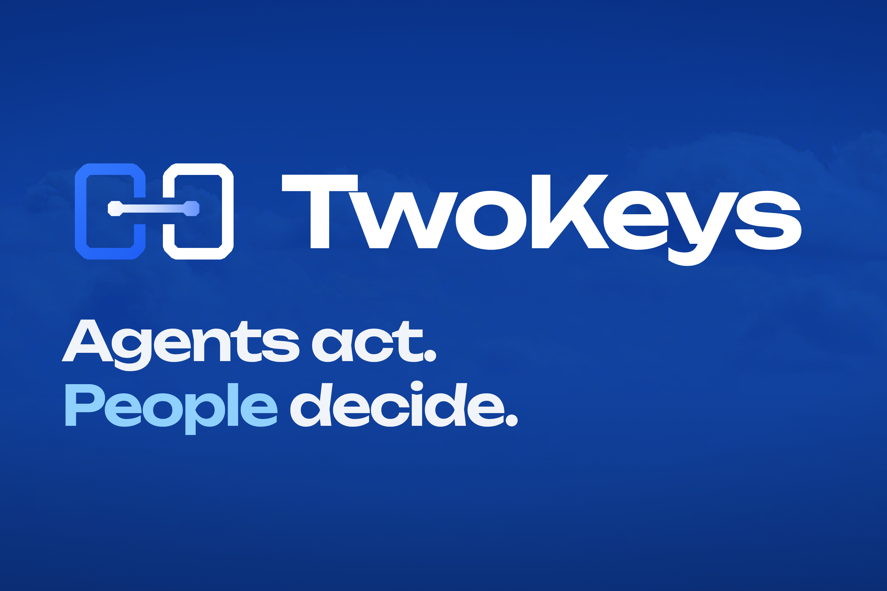

<p align="center">
  
</p>

# TwoKeys

> **Agents act. People decide.**

TwoKeys is an authorization boundary for agent actions. An agent can keep its
tools, credentials, and autonomy, but a material action only runs after every
responsible role approves the same action, evidence, and policy version.

The agent holds the technical capability to act. The organization holds the
authority to decide. TwoKeys connects both through a small HTTP, MCP, or Google
ADK integration.

## Why it exists

Giving an agent API access does not mean every action it can perform has company
consent. Ordinary approval flows also fail when the plan changes after one
person has approved it or when an old approval can be replayed.

TwoKeys makes those boundaries explicit:

- deterministic policy resolves the required keyholders from the action;
- each keyholder receives the same canonical decision with role-specific context;
- material changes create a new version and invalidate prior approvals;
- matching approvals issue a time-bound, revocable, single-use `ActionLease`;
- the executor revalidates the lease before making the external call.

```text
Agent -> propose action -> policy resolves owners -> people decide
                                                   |
                                  matching approvals only
                                                   v
                                      single-use ActionLease -> executor
```

## Demo

The hackathon scenario starts with a Revenue Agent proposing a 14-day,
EUR 30,000 Google Ads campaign:

1. Finance approves version 1.
2. The CEO adds a material execution condition.
3. Finance's approval becomes stale because the action is now version 2.
4. Finance and the CEO approve the same version.
5. TwoKeys issues and consumes one lease, then rejects a replay.

The local demo uses synthetic business evidence and a simulated campaign. The
production adapter targets a preconfigured Google Ads **test account**, which
has no billing and serves no ads.

## Run locally

Requires Node.js 24.

```bash
cd web
npm ci
LOCAL_DEMO_AUTH=true npm run dev
```

Open [http://localhost:3000](http://localhost:3000) for the product site or
[http://localhost:3000/demo](http://localhost:3000/demo) for the decision flow.
Without a Gemini API key, development uses the built-in deterministic surface
fallback; execution is simulated by default.

Run the local checks:

```bash
cd web
npm test
npm run build
```

Run the optional Gemma evidence-safety benchmark with Application Default
Credentials and a billing-enabled Google Cloud project:

```bash
cd web
GOOGLE_CLOUD_PROJECT=your-project npm run gemma:screen
```

The command calls `gemma-4-26b-a4b-it-maas` against one benign and one hostile
fixture, then fails unless Gemma detects the frozen prompt injection and personal
identifier. Its result is evaluation evidence only; it cannot authorize or block
an action.

The Firestore emulator check and the guarded Cloud Run deployment are documented
in [GCP deployment](docs/03-system/gcp-deployment.md), including the keyless
GitHub Actions auto-deploy path.

## Connect an agent

The integration surface is one proposal and one wait:

```text
propose_action(action, evidence) -> authorized | pending
await_decision(decision_id)      -> lease | denial | pending
```

Run the included MCP server:

```bash
cd web
TWOKEYS_BASE_URL=http://localhost:3000 npm run mcp
```

The repository also includes an HTTP seam, a Google ADK adapter, and install
examples for supported agent harnesses. See
[Harness integrations](docs/03-system/integrations.md).

## What is implemented

- Next.js product site and role-authenticated decision console
- deterministic policy, canonicalization, hashes, approval invalidation, and leases
- isolated Finance and CEO surfaces composed with Gemini and validated as A2UI
- in-memory development state and transactional Firestore persistence
- MCP, HTTP, and Google ADK agent adapters
- simulated execution plus a guarded Google Ads test-account adapter and read-back
- a Gemma 4 MaaS evidence screen with a measurable benign/hostile benchmark
- automated coverage for authority, replay, expiry, revocation, isolation,
  adaptation, integrations, and failure-closed behavior

The local application and automated suite are implemented and passing. A live
Cloud Run deployment, the real Google Ads test-account mutation, and published
benchmark artifacts remain pending. TwoKeys is a hackathon build, not a
production-ready authorization system.

## Core invariant

```text
No executor call unless every required role approved
the same action hash, evidence hash, policy version, and unexpired lease.
```

Gemini may organize and explain decision context. Deterministic code owns policy,
calculations, hashes, approval validity, lease consumption, and execution.

## Repository map

| Path | Contents |
|---|---|
| [`web/`](web/) | Next.js UI, API routes, authority kernel, adapters, and tests |
| [`web/integrations/plugin/`](web/integrations/plugin/) | Distributable agent-harness plugin bundle |
| [`infra/deploy.sh`](infra/deploy.sh) | Guarded Google Cloud deployment |
| [`diagrams/`](diagrams/) | Architecture source, editable Excalidraw scene, SVG, and PNG |
| [`docs/01-product/`](docs/01-product/) | Product vision and scope |
| [`docs/02-demo/`](docs/02-demo/) | Scenario and four-minute demo script |
| [`docs/03-system/`](docs/03-system/) | Architecture, contracts, UI, integrations, and deployment |
| [`docs/04-validation/`](docs/04-validation/) | Benchmark contract and claims ledger |
| [`docs/05-delivery/project-story.md`](docs/05-delivery/project-story.md) | Devpost Project Story draft with GIF slots |

Start with the [documentation map](docs/README.md) for the full project record.
