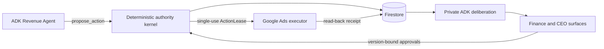

# TwoKeys


> **Technical permission is not company authorization.**

TwoKeys is a decision boundary for always-on agents. An agent may have the API
access required to act, but access is not a mandate to commit the organization.
TwoKeys binds one exact action to the roles that own it, helps each of them reach
a decision through conversation grounded in retrieved evidence, and executes only
after every required role has approved the same version.

The agent holds one key: the technical capability to perform the action. The
organization holds the other: the authority to take it. That second key may have
one holder or several, and every holder must turn it on the same version.

It ships as a plugin for agent harnesses. Your agents keep their tools and their
autonomy, and integrate through one call: `propose_action(action, evidence)`
returns a single-use execution permit or a denial. Behind that call TwoKeys runs
its own agent, whose only job is to help the resolved keyholders decide. That
agent holds no company credentials, cannot execute, and has no proposal of its
own to defend.

**Capability is one key. Authority is the other.**

## Hackathon direction

- **Track:** The Collaborative Partner
- **Scenario:** a Revenue Agent proposes activating a EUR 30,000 Google Ads
  campaign for 14 days
- **Keyholders:** Finance and CEO
- **Core transition:** Finance approves v1; the CEO adds a material condition;
  Finance's approval becomes stale; both approve v2
- **External consequence:** a preconfigured campaign changes from `PAUSED` to
  `ENABLED` in a Google Ads test account
- **Adaptation proof:** explicit CEO feedback changes only the CEO's surface in a
  later episode

The Google Ads account is a test account. It has no billing, serves no ads, and
produces no live spend or serving metrics. Business metrics shown in the demo are
frozen synthetic evidence.

## Product invariant

```text
No executor call unless every required role approved
the same action hash, evidence hash, policy version, and unexpired lease.
```

Gemini may interpret evidence, explain trade-offs, select approved UI components,
and adapt their order. Deterministic code owns calculations, policy, hashes,
approval validity, lease consumption, and the final Google Ads mutation.

## Status

| Area | Status |
|---|---|
| Product direction | Decided |
| Scope and demo contract | Decided |
| Web app, backend, authority kernel, and GCP deployment shape | Implemented and locally verified |
| Google Ads mutation | REST adapter and read-back contract tested; live test-account run pending credentials |
| Benchmark results | 54 automated authority, agent, adapter, privacy, replay and execution checks pass locally; live Gemini and Ads runs pending |
| Production readiness | Not yet demonstrated |

This repository must not claim completed implementation or zero failures until
the corresponding evidence exists.

## Run the complete local demo

```bash
cd web
cp .env.example .env.local
npm ci
npm run dev
```

Open <http://localhost:3000/demo>. The no-credential path is deliberately
labelled `LOCAL FALLBACK` and uses the in-memory store plus the simulated Ads
gateway. Add `GEMINI_API_KEY` to run the ADK agents; the production deploy also
requires the Secret Manager and Google Ads test-account values in
[`infra/deploy.sh`](infra/deploy.sh).

## Runtime flow



## Documentation

Start with the [documentation map](docs/README.md), then use the path that fits
your task:

| Need | Document |
|---|---|
| Understand the thesis | [Product vision](docs/01-product/vision.md) |
| Know what is in and out | [Scope lock](docs/01-product/scope.md) |
| Build the exact story | [Demo scenario](docs/02-demo/scenario.md) |
| Record the four-minute video | [Demo script](docs/02-demo/four-minute-script.md) |
| Implement the system | [Architecture](docs/03-system/architecture.md) and [contracts](docs/03-system/contracts.md) |
| Build the role-specific interface | [Role-aware UI](docs/03-system/role-aware-ui.md) |
| Evaluate the result | [Benchmark](docs/04-validation/benchmark.md) |
| Keep the pitch honest | [Claims and evidence](docs/04-validation/claims.md) |
| Execute the first sprint | [48-hour plan](docs/05-delivery/plan-48h.md) |

## Deliberate exclusions

TwoKeys is not an IAM replacement, an agent Fleet, a generic approval platform,
or a generated-dashboard product. The ActionLease is an internal execution
permit. The company is the scenario, not a new platform category.
