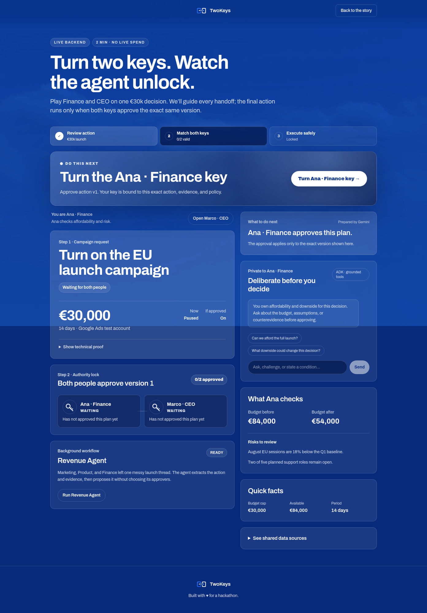

# Google Cloud deployment evidence

Captured on 2026-08-31 UTC from application commit `f272f88`.

- Live demo: <https://twokeys.migarci2.dev/demo>
- Health endpoint: <https://twokeys.migarci2.dev/api/health>



## Deployment record

| Resource | Observed value |
|---|---|
| Google Cloud project | `gen-lang-client-0046326200` |
| Cloud Run service | `twokeys` in `europe-west1` |
| Ready revision | `twokeys-00001-9db`, receiving 100% of traffic |
| Runtime identity | `twokeys-runtime@gen-lang-client-0046326200.iam.gserviceaccount.com` |
| Cloud Build | `b7adf68d-100a-4e80-8f51-1e66490181e7` — `SUCCESS` |
| Container image | `europe-west1-docker.pkg.dev/gen-lang-client-0046326200/twokeys/web:f272f88` |
| Image digest | `sha256:874ff0f31597044eb1ec59a41be1bd2bdf38553d9b5a0798e8b9dcb50dbc4fc1` |
| Firestore | Native database `(default)` in `eur3`, with delete protection |
| Public edge | Cloudflare Worker `twokeys-gcp-proxy` on `twokeys.migarci2.dev` |

The Worker is only the custom-domain TLS proxy. The application, state, secrets,
and Gemini calls run on Google Cloud. Its deployed source is preserved at
[`infra/cloudflare-worker.js`](../../infra/cloudflare-worker.js).

## Live canary

The public URL was checked after deployment:

- `/api/health` returned `{"status":"ok","state":"firestore"}`;
- `/demo` returned HTTP 200 and loaded in 1.185 seconds;
- code-free public demo login succeeded;
- Firestore-backed decision state loaded;
- the role surface completed through the live Gemini path and displayed
  `Prepared by Gemini`;
- no browser console errors were observed.

The screenshot above has SHA-256
`8cc5338327cfddfc4336379807f3f685e27094781e2aa32e0bde3fe74d42bb8f`.

## Claim boundary

This deployment deliberately uses `DEPLOY_PROFILE=demo`: Gemini and Firestore
are live, while Google Ads execution is simulated and labelled as such. It is
not evidence of a real Google Ads test-account mutation or a completed live
Gemma MaaS benchmark.

## Recheck

```bash
gcloud run services describe twokeys \
  --project gen-lang-client-0046326200 \
  --region europe-west1

curl -fsS https://twokeys.migarci2.dev/api/health
```
