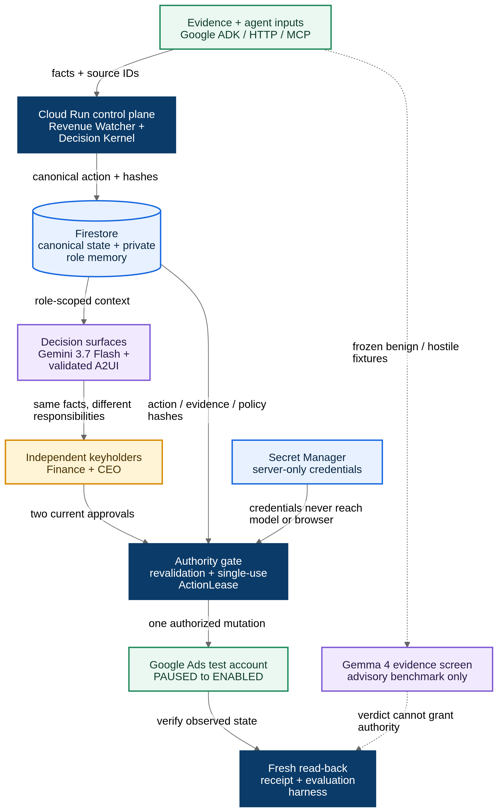

# TwoKeys: Agents act. People decide.

## A note to the judges: what control looks like in an agentic future

You are about to review systems that make agents faster, smarter, and more
autonomous. We ask you to apply one more lens to TwoKeys:

> **When an agent already has the credentials to act, who decides whether the
> company should act?**

We did not build an approval button around a model. We built the boundary that
makes long-running agents useful without pretending that API access equals
organizational consent. Most actions can still run freely. Material actions are
routed, by deterministic policy, to the people who own the decision. If the
proposal changes, consent resets. If every required role agrees, permission
exists once, for that exact version, and then spends itself.

A winning agentic project should demonstrate more than what a model can do. It
should show how agents and people can act together without confusing capability
with consent. That is the future TwoKeys is built for.

<!--
GIF SLOT 1: The thesis in five seconds
Show: agent has Google Ads API access -> organizational authority is missing -> execution is blocked.
Suggested Markdown: 
-->

## Inspiration

Agents are moving from answering questions to running continuously with access
to real company tools. That creates a new problem: the same credentials that let
an agent prepare a report can also let it spend money, publish a commitment, or
change a production system.

Existing controls are necessary, but they answer a different question. Identity
and access management can decide whether an agent may call an API. A fixed
approval step can decide who reviews a known workflow. Neither one naturally
answers a decision that does not exist until an agent proposes it:

> Should this exact action, with this budget, evidence, timing, and risk, bind
> the company now?

We were inspired by the gap between technical capability and organizational
consent. A useful agent cannot stop for permission on every harmless action. A
responsible organization cannot give one standing approval to every action the
agent may invent later. TwoKeys resolves that tension per action: routine work
can move, while consequential work reaches the people whose responsibilities
make the decision theirs.

The name describes two kinds of key, not two fixed people. The agent holds the
capability key. The organization holds the authority key. One action needs both.

## What it does

TwoKeys is a plugin and decision boundary for the agents a company already
runs. The integration is deliberately small:

```text
propose_action(action, evidence) -> authorized | pending
await_decision(decision_id)      -> lease | denial | pending
```

Behind those two calls, TwoKeys turns a proposed action into a versioned,
auditable decision:

1. An agent proposes a complete action and cites its evidence.
2. Deterministic policy reads the action's material properties and resolves the
   roles that must approve it. The proposing agent cannot choose its approvers.
3. Every keyholder receives the same canonical Action Capsule, but the supporting
   context is organized around that person's responsibility.
4. A material change creates a new action version. Every approval on the old
   version becomes stale automatically.
5. When all required roles approve the same action hash, evidence hash, and
   policy version, TwoKeys issues a short-lived, revocable, single-use
   `ActionLease`.
6. The executor revalidates and consumes that lease before making one external
   call. Replays fail before a second call can happen.

Our hackathon story makes the mechanism visible through one concrete decision.
A Revenue Agent proposes activating a EUR 30,000 Google Ads campaign for 14
days. Finance approves version 1. The CEO adds a material execution condition,
which creates version 2 and makes Finance's first approval stale. Both roles
review and approve version 2 before a lease can exist.

The company, people, and business evidence in the demo are synthetic. The
external adapter targets a Google Ads test account, which has no billing and
serves no ads.

<!--
GIF SLOT 2: The approval that disappears
Show: Finance approves v1 -> CEO adds a condition -> action becomes v2 -> Finance changes to STALE.
Suggested Markdown: 
-->

TwoKeys also remembers explicit interaction preferences without turning one
person's preference into company policy. If the CEO asks to see the smallest
reversible option first for decisions above EUR 20,000, a later CEO surface can
lead with that option. Finance's surface and the authorization policy remain
unchanged.

<!--
GIF SLOT 3: Same truth, different responsibilities
Show: Finance and CEO side by side with matching hashes, then the CEO memory-off/memory-on comparison.
Suggested Markdown: 
-->

## How we built it

We separated explanation from authority. Models help people understand a
decision; deterministic code decides whether execution is legal.

The system has seven logical parts, kept inside one deployable application where
possible:

- A Revenue Agent built with Google ADK proposes actions through the same seam
  available to external agents.
- A deterministic Decision Kernel validates the closed action schema, performs
  calculations, resolves keyholders, creates canonical hashes, versions material
  changes, and evaluates approval validity.
- Firestore stores shared decision state, isolated role memory, approvals,
  leases, model-run evidence, and receipts.
- Gemini 3.7 Flash composes separate Finance and CEO decision surfaces from
  server-owned data references.
- A trusted Next.js renderer accepts only an allowlisted A2UI component catalog.
  The model cannot emit arbitrary HTML, JavaScript, calculations, or actions.
- The ActionLease gate consumes authority atomically before the Google Ads
  adapter mutates anything, then reads the resource back and records a receipt.
- The evaluation harness tests authority, stale consent, replay, expiry,
  revocation, numeric fidelity, role isolation, and later adaptation.

We also added a separate Gemma 4 26B A4B IT MaaS evaluation. Gemma screens a
frozen benign/hostile evidence pair for prompt-injection and personal-data
signals. Its JSON is validated by deterministic code, and its verdict is never
read by the authority kernel. This gives the second model a measurable job
without turning it into a decorative dependency or a new security boundary.

The application is packaged for Cloud Run with Firestore, Secret Manager, and a
dedicated runtime service account. Agents can connect through HTTP, MCP, or the
Google ADK adapter. The deployment path also supports keyless GitHub Actions
authentication through Workload Identity Federation.



## Challenges we ran into

### Drawing the boundary in the right place

The easiest version of this product was a dashboard with two approval buttons.
That would not solve the real failure. The difficult part was defining what must
remain outside the model: calculations, policy, hashes, state transitions,
approval validity, lease consumption, and execution.

### Letting the interface adapt without letting truth drift

Finance and the CEO need different context, but they cannot receive different
facts. We made the Action Capsule deterministic and identical across roles, then
allowed Gemini to select and order only approved presentation components. Every
number resolves from the server-owned fact model instead of model text.

### Making consent survive time, but not change

An approval is not meaningful if it can silently follow a proposal after the
budget, timing, evidence, or conditions change. We had to treat every material
change as a new immutable version and bind approvals to the exact action,
evidence, and policy hashes they covered.

### Handling an external call that may fail ambiguously

Retries are dangerous after a provider may have accepted a mutation. The lease
is consumed before the external call, so a timeout cannot trigger a blind second
mutation. Recovery requires reading the external state and reconciling what
actually happened.

### Keeping the proof understandable

The architecture touches agents, generated interfaces, memory, policy,
transactions, leases, and Google Ads. The challenge was not adding more. It was
cutting the story to one agent, one campaign, two roles, one material change, one
external consequence, and one later episode.

## Accomplishments that we're proud of

- We reduced integration to one proposal and one wait. The calling agent keeps
  its existing tools, credentials, and autonomy.
- We made approver selection a deterministic function of the action, so the
  proposing agent cannot route around an inconvenient keyholder.
- We split the proposing agent from the deliberation agent. The component helping
  a person decide has no company credentials, cannot execute, and has no proposal
  of its own to defend.
- We made stale consent a state transition, not a warning label. A material
  change invalidates old approvals by construction.
- We built a single-use permit that fails closed on missing, stale, expired,
  revoked, mismatched, or replayed authority.
- We isolated role memory and left canaries in the evaluation path so privacy
  claims can be measured rather than assumed.
- Our local automated suite currently passes 49 checks across the authority
  kernel, agent seam, adapters, executor, sessions, surfaces, memory isolation,
  and Gemma screen contract.
- We kept the claims honest: synthetic business data is labelled, a test-account
  campaign is not described as live spend, and planned external proof remains
  planned until the receipt exists.

<!--
GIF SLOT 4: Permission spends itself
Add only after the live test-account run passes.
Show: both keys match -> lease issued -> PAUSED becomes ENABLED -> receipt -> replay denied.
Suggested Markdown: 
-->

## What we learned

**Approval is not the hard part. Version binding is.** The dangerous case is not
always “nobody approved.” It is two people approving two different realities, or
an old yes surviving a new plan.

**Authority should be computed from the action, not configured around the
agent.** A fixed harness must be either restrictive all the time or permissive
all the time. Resolving keyholders from each action lets routine work stay fluid
and reserves human attention for decisions that deserve it.

**Personalization and policy are different systems.** Remembering how one person
wants to inspect a decision can improve collaboration. Allowing that preference
to change shared facts or authorization rules would destroy trust. The boundary
between those two is a product feature.

**Generated UI is safest when the model arranges trusted pieces.** An allowlisted
catalog and server-owned data references gave us useful adaptation without
giving the model a blank page or a calculator.

**A small, falsifiable claim is stronger than a large promise.** We do not need
to claim universal safety or a control plane for every enterprise agent. We need
to show one consequential action, one visible consent failure, and one executor
that refuses to move until the keys match.

## What's next for TwoKeys

First, we will finish the proof for the slice already built:

1. Run the complete flow on Cloud Run against the Google Ads test account.
2. Retain the provider request ID and read-back receipt for the single mutation.
3. Publish the predeclared benchmark, including failures and the live Gemma G1
   output.
4. Record the four-minute continuous demo with the test-account and synthetic-data
   labels visible throughout.

After that evidence is frozen, the next product steps are deliberately narrow:

- add more action vocabularies and versioned policy rules without becoming a
  generic agent-control platform;
- support delegation and escalation when a resolved keyholder is unavailable;
- connect more agent harnesses through the existing HTTP and MCP seam;
- add more external executors that preserve the same consume, call, read-back,
  and reconcile contract;
- harden identity, audit retention, policy administration, and operational
  recovery for real organizations.

The long-term goal is not to put a human in front of every agent action. It is to
make autonomy legible: agents should move freely when the action is routine, and
the organization should retain the final key when the action commits it.

> **One action. Two views. Two keys.**
